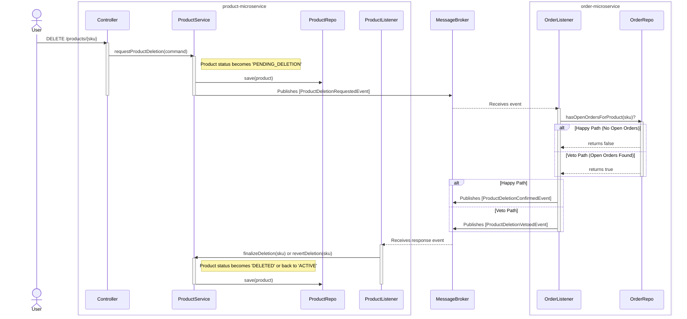

```mermaid
sequenceDiagram
    actor User
    
    box product-microservice
        participant Controller
        participant ProductService
        participant ProductRepo
        participant ProductListener
    end

    participant MessageBroker

    box order-microservice
        participant OrderListener
        participant OrderRepo
    end

    User->>Controller: DELETE /products/{sku}
    activate Controller
    Controller->>ProductService: requestProductDeletion(command)
    activate ProductService
    Note right of ProductService: Product status becomes 'PENDING_DELETION'
    ProductService->>ProductRepo: save(product)
    ProductService->>MessageBroker: Publishes [ProductDeletionRequestedEvent]
    deactivate ProductService
    deactivate Controller

    MessageBroker-->>OrderListener: Receives event
    activate OrderListener
    OrderListener->>OrderRepo: hasOpenOrdersForProduct(sku)?
    activate OrderRepo
    
    alt Happy Path (No Open Orders)
        OrderRepo-->>OrderListener: returns false
    else Veto Path (Open Orders Found)
        OrderRepo-->>OrderListener: returns true
    end
    deactivate OrderRepo
    
    alt Happy Path
        OrderListener->>MessageBroker: Publishes [ProductDeletionConfirmedEvent]
    else Veto Path
        OrderListener->>MessageBroker: Publishes [ProductDeletionVetoedEvent]
    end
    deactivate OrderListener
    
    MessageBroker-->>ProductListener: Receives response event
    activate ProductListener
    ProductListener->>ProductService: finalizeDeletion(sku) or revertDeletion(sku)
    activate ProductService
    Note right of ProductService: Product status becomes 'DELETED' or back to 'ACTIVE'
    ProductService->>ProductRepo: save(product)
    deactivate ProductService
    deactivate ProductListener
```