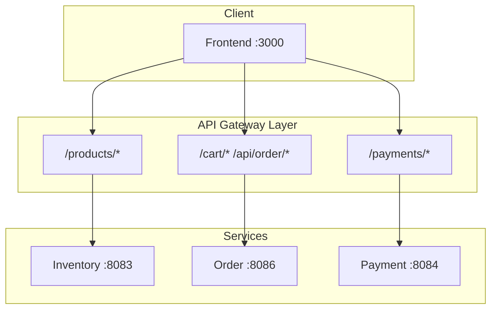

# API Reference

## Service Communication



## Swagger UI (Live Documentation)

Each service exposes OpenAPI documentation via Swagger UI:

| Service | Swagger UI | OpenAPI Spec |
|---------|------------|--------------|
| Inventory | http://localhost:8083/swagger-ui.html | http://localhost:8083/v3/api-docs |
| Order | http://localhost:8086/swagger-ui.html | http://localhost:8086/v3/api-docs |
| Payment | http://localhost:8084/swagger-ui.html | http://localhost:8084/v3/api-docs |

## Generate Static OpenAPI Specs

```bash
# Start services
docker-compose up -d

# Generate specs (saves to docs/api/)
./scripts/generate-openapi.sh

# Or manually
curl http://localhost:8083/v3/api-docs > docs/api/inventory-openapi.json
curl http://localhost:8086/v3/api-docs > docs/api/order-openapi.json
curl http://localhost:8084/v3/api-docs > docs/api/payment-openapi.json
```

## Service Endpoints Overview

### Inventory Service (Port 8083)

- `GET /products/{sku}` - Get product
- `GET /products/by-skus` - Batch get products
- `POST /products` - Create product
- `PUT /products/{sku}` - Update product
- `GET /products/category/{name}` - Products by category
- `GET /products/search` - Search products

### Order Service (Port 8086)

- `GET /cart/{userId}` - Get cart
- `POST /cart` - Add to cart
- `PUT /cart/{userId}/{sku}` - Update quantity
- `DELETE /cart/{userId}/{sku}` - Remove item
- `POST /api/order` - Create order
- `GET /api/order/customer/{userId}` - Get orders

### Payment Service (Port 8084)

- `POST /payments` - Create payment
- `POST /payments/{id}/process` - Process payment
- `GET /payments/{id}` - Get payment
- `GET /payments/order/{orderId}` - Get by order

## Health Endpoints

All services expose:

| Endpoint | Description |
|----------|-------------|
| `/actuator/health` | Health check |
| `/actuator/health/liveness` | K8s liveness probe |
| `/actuator/health/readiness` | K8s readiness probe |
