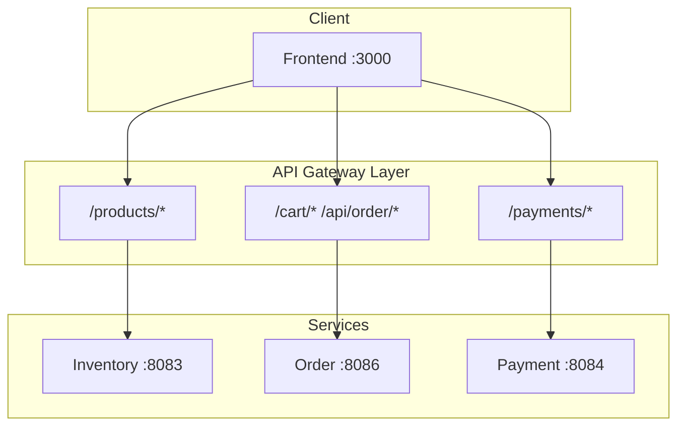

# API Reference

## Service Communication

## Inventory Service (Port 8083)

### Products

| Method | Endpoint | Description |
|--------|----------|-------------|
| GET | `/products/{sku}` | Get product by SKU |
| GET | `/products/by-skus?skus=...` | Get products by SKU list |
| POST | `/products` | Create product |
| PUT | `/products/{sku}` | Update product |
| GET | `/products/category/{categoryName}` | Get products by category |
| GET | `/products/search?keyword=...` | Search products |
| GET | `/products/{sku}/related` | Get related products |
| POST | `/products/{sku}/categories/{categoryName}` | Assign to category |
| POST | `/products/{sku}/volume/reduce?quantity=...` | Reduce stock |
| POST | `/products/{sku}/volume/increase?quantity=...` | Increase stock |

### Categories

| Method | Endpoint | Description |
|--------|----------|-------------|
| GET | `/products/categories` | List categories |

---

## Order Service (Port 8086)

### Shopping Cart

| Method | Endpoint | Description |
|--------|----------|-------------|
| GET | `/cart/{userId}` | Get user cart |
| POST | `/cart` | Add items to cart |
| PUT | `/cart/{userId}/{sku}` | Update item quantity |
| DELETE | `/cart/{userId}/{sku}` | Remove item |
| DELETE | `/cart/{userId}` | Clear cart |

### Orders

| Method | Endpoint | Description |
|--------|----------|-------------|
| POST | `/api/order` | Create order |
| PATCH | `/api/order/{orderId}/status` | Update order status |
| GET | `/api/order/customer/{userId}` | Get customer orders |
| GET | `/api/order/customer/{userId}/paged` | Get orders (paginated) |

---

## Payment Service (Port 8084)

### Payments

| Method | Endpoint | Description |
|--------|----------|-------------|
| POST | `/payments` | Create payment |
| POST | `/payments/{paymentId}/process` | Process payment |
| POST | `/payments/{paymentId}/retry` | Retry failed payment |
| POST | `/payments/{paymentId}/cancel` | Cancel payment |
| GET | `/payments/{paymentId}` | Get payment by ID |
| GET | `/payments/order/{orderId}` | Get payment by order |
| GET | `/payments/status/{status}` | List by status |
| GET | `/payments/statistics` | Get statistics |

---

## Health Endpoints

All services expose Spring Boot Actuator endpoints:

| Endpoint | Description |
|----------|-------------|
| `/actuator/health` | Health check |
| `/actuator/health/liveness` | Liveness probe |
| `/actuator/health/readiness` | Readiness probe |
| `/actuator/metrics` | Metrics |
| `/actuator/prometheus` | Prometheus metrics |
