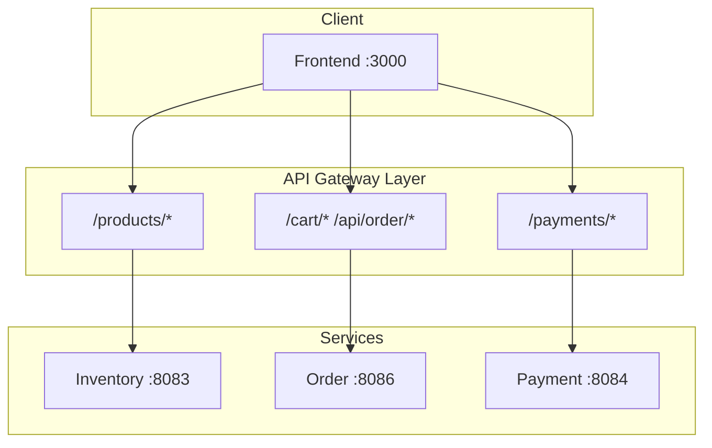

# API Reference

## Service Communication


```mermaid
flowchart TB
    subgraph Client
        FE[Frontend :3000]
    end

    subgraph API Gateway Layer
        direction LR
        INV_API["/products/*"]
        ORD_API["/cart/* /api/order/*"]
        PAY_API["/payments/*"]
    end

    subgraph Services
        INV[Inventory :8083]
        ORD[Order :8086]
        PAY[Payment :8084]
    end

    FE --> INV_API --> INV
    FE --> ORD_API --> ORD
    FE --> PAY_API --> PAY
```

## Swagger UI (Live Documentation)

Each service exposes OpenAPI documentation via Swagger UI:

| Service | Swagger UI | OpenAPI Spec |
|---------|------------|--------------|
| Inventory | http://localhost:8083/swagger-ui.html | http://localhost:8083/v3/api-docs |
| Order | http://localhost:8086/swagger-ui.html | http://localhost:8086/v3/api-docs |
| Payment | http://localhost:8084/swagger-ui.html | http://localhost:8084/v3/api-docs |

## Generate Static OpenAPI Specs

OpenAPI specs are automatically generated to `docs/api/` during build:

```bash
# Generate all specs (starts each service, fetches spec, shuts down)
./gradlew generateOpenApiDocs

# Or generate per service
./gradlew :inventory-microservice:generateOpenApiDocs
./gradlew :order-microservice:generateOpenApiDocs
./gradlew :payment-microservice:generateOpenApiDocs
```

Generated files:
- `docs/api/inventory-openapi.json`
- `docs/api/order-openapi.json`
- `docs/api/payment-openapi.json`

## Service Endpoints Overview

### Inventory Service (Port 8083)

- `GET /products/{sku}` - Get product
- `GET /products/by-skus` - Batch get products
- `POST /products` - Create product
- `PUT /products/{sku}` - Update product
- `GET /products/category/{name}` - Products by category
- `GET /products/search` - Search products

### Order Service (Port 8086)

- `GET /cart` - Get the current guest or authenticated customer cart
- `POST /cart/items` - Add items to the current cart
- `PUT /cart/items/{sku}` - Update an item quantity in the current cart
- `DELETE /cart/items/{sku}` - Remove an item from the current cart
- `DELETE /cart` - Clear the current cart
- `POST /cart/merge` - Merge the guest cart into the authenticated customer cart and expire the guest cookie
- `POST /api/order` - Create an order from the authenticated customer orders cart (no request body)
- `GET /api/order` - Get the authenticated customer orders orders
- `GET /api/order/paged` - Get the authenticated customer orders orders with pagination

Authenticated cart and order routes derive ownership exclusively from the validated JWT `sub` claim; guest cart requests use an opaque HttpOnly `guest_cart_id` cookie, and `POST /cart/merge` transfers that cart after login. Unknown fields such as `user_id` cannot override ownership.

### Payment Service (Port 8084)

- `POST /payments` - Create payment
- `POST /payments/{id}/process` - Process payment
- `GET /payments/{id}` - Get payment
- `GET /payments/order/{orderId}` - Get by order

## Health Endpoints

All services expose:

| Endpoint | Description |
|----------|-------------|
| `/actuator/health` | Health check |
| `/actuator/health/liveness` | K8s liveness probe |
| `/actuator/health/readiness` | K8s readiness probe |
