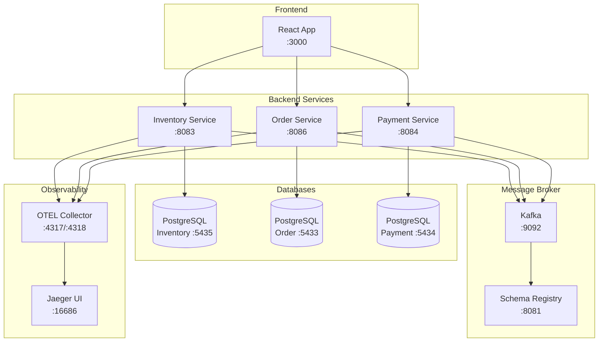
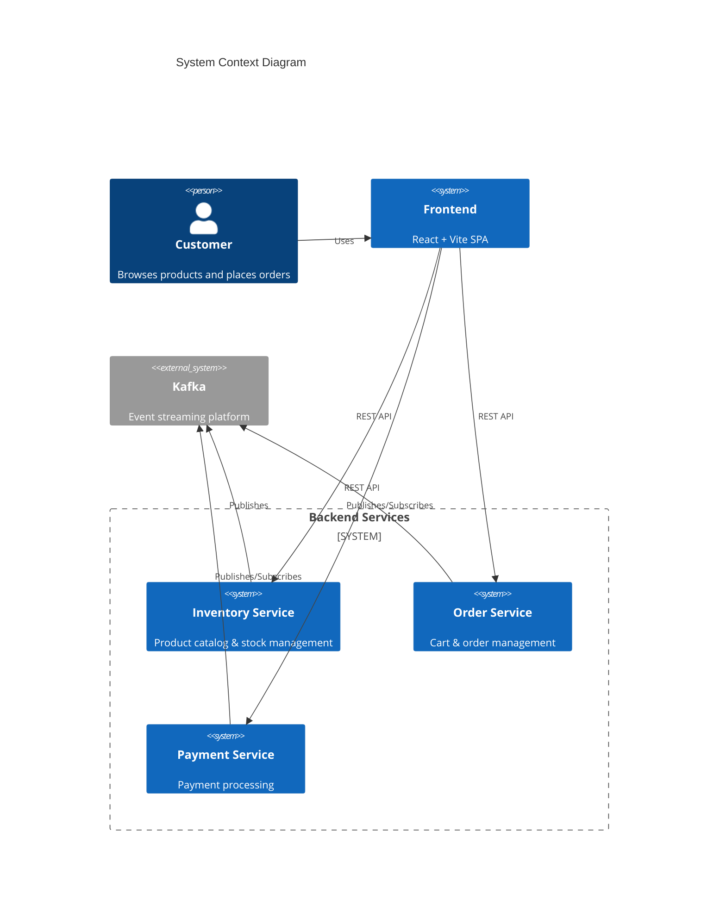
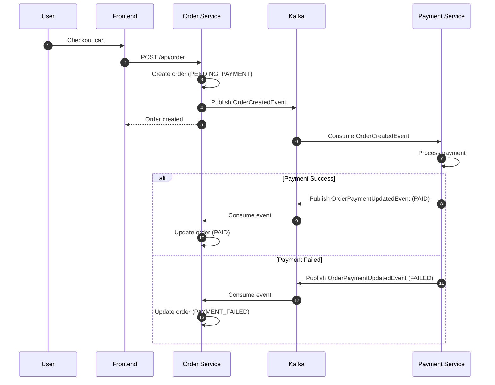
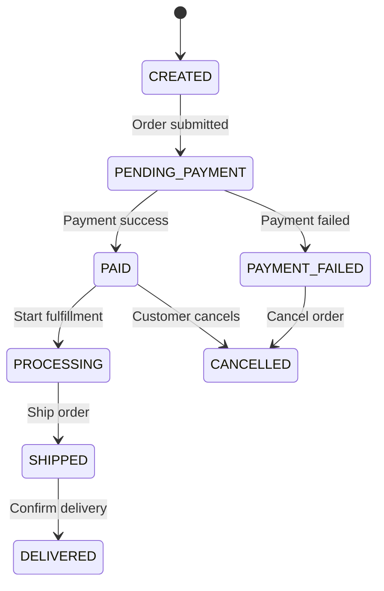

# Architecture

## System Overview

```mermaid
graph TB
    subgraph Frontend
        UI[React App<br/>:3000]
    end

    subgraph Backend Services
        INV[Inventory Service<br/>:8083]
        ORD[Order Service<br/>:8086]
        PAY[Payment Service<br/>:8084]
    end

    subgraph Message Broker
        KAFKA[Kafka<br/>:9092]
        SR[Schema Registry<br/>:8081]
    end

    subgraph Databases
        PG1[(PostgreSQL<br/>Inventory :5435)]
        PG2[(PostgreSQL<br/>Order :5433)]
        PG3[(PostgreSQL<br/>Payment :5434)]
    end

    subgraph Observability
        OTEL[OTEL Collector<br/>:4317/:4318]
        JAEGER[Jaeger UI<br/>:16686]
    end

    UI --> INV
    UI --> ORD
    UI --> PAY

    INV --> KAFKA
    ORD --> KAFKA
    PAY --> KAFKA
    KAFKA --> SR

    INV --> PG1
    ORD --> PG2
    PAY --> PG3

    INV --> OTEL
    ORD --> OTEL
    PAY --> OTEL
    OTEL --> JAEGER
```

## Component Diagram

```mermaid
C4Context
    title System Context Diagram

    Person(user, "Customer", "Browses products and places orders")

    System(frontend, "Frontend", "React + Vite SPA")

    System_Boundary(backend, "Backend Services") {
        System(inventory, "Inventory Service", "Product catalog & stock management")
        System(order, "Order Service", "Cart & order management")
        System(payment, "Payment Service", "Payment processing")
    }

    System_Ext(kafka, "Kafka", "Event streaming platform")

    Rel(user, frontend, "Uses")
    Rel(frontend, inventory, "REST API")
    Rel(frontend, order, "REST API")
    Rel(frontend, payment, "REST API")
    Rel(order, kafka, "Publishes/Subscribes")
    Rel(payment, kafka, "Publishes/Subscribes")
    Rel(inventory, kafka, "Publishes")
```

## Services

### Inventory Service (Port 8083)
- Product catalog management
- Category management
- Stock/volume tracking
- Database: PostgreSQL (port 5435)

### Order Service (Port 8086)
- Shopping cart operations
- Order lifecycle management
- Coordinates with payment via Kafka
- Database: PostgreSQL (port 5433)

### Payment Service (Port 8084)
- Payment processing
- Listens to order-created events
- Publishes payment status updates
- Database: PostgreSQL (port 5434)

### Frontend (Port 3000)
- React + Vite + TypeScript
- Communicates with all backend services

## Event Flow

### Purchase Saga (Choreography)

```mermaid
sequenceDiagram
    autonumber
    participant U as User
    participant F as Frontend
    participant O as Order Service
    participant K as Kafka
    participant P as Payment Service

    U->>F: Checkout cart
    F->>O: POST /api/order
    O->>O: Create order (PENDING_PAYMENT)
    O->>K: Publish OrderCreatedEvent
    O-->>F: Order created

    K->>P: Consume OrderCreatedEvent
    P->>P: Process payment
    alt Payment Success
        P->>K: Publish OrderPaymentUpdatedEvent (PAID)
        K->>O: Consume event
        O->>O: Update order (PAID)
    else Payment Failed
        P->>K: Publish OrderPaymentUpdatedEvent (FAILED)
        K->>O: Consume event
        O->>O: Update order (PAYMENT_FAILED)
    end
```

### Order State Machine

```mermaid
stateDiagram-v2
    [*] --> CREATED
    CREATED --> PENDING_PAYMENT: Order submitted
    PENDING_PAYMENT --> PAID: Payment success
    PENDING_PAYMENT --> PAYMENT_FAILED: Payment failed
    PAID --> PROCESSING: Start fulfillment
    PROCESSING --> SHIPPED: Ship order
    SHIPPED --> DELIVERED: Confirm delivery
    PAYMENT_FAILED --> CANCELLED: Cancel order
    PAID --> CANCELLED: Customer cancels
```

## Kafka Topics

| Topic | Producer | Consumer | Event Type |
|-------|----------|----------|------------|
| `order-created` | Order | Payment | OrderCreatedEvent |
| `order-payment` | Payment | Order | OrderPaymentUpdatedEvent |
| `order-updated` | Order | - | OrderUpdatedEvent |
| `product-created` | Inventory | - | ProductCreatedEvent |
| `product-updated` | Inventory | Order | ProductUpdatedEvent |

## Databases

| Service | Database | Port | Schema |
|---------|----------|------|--------|
| Inventory | bookstore-inventory | 5435 | bookstore |
| Order | bookstore-order | 5433 | - |
| Payment | bookstore-payment | 5434 | bookstore |

## Observability

- **Tracing**: OpenTelemetry + Jaeger
- **Collector**: OTEL Collector (ports 4317/4318)
- **UI**: Jaeger at http://localhost:16686
- **Logs**: Include `traceId` and `spanId` for correlation

## Shared Kernel

Common components in `shared-kernel` module following DRY principle:

| Component | Purpose |
|-----------|---------|
| `SharedWebConfig` | CORS configuration for all services |
| `SharedTransactionManagerConfig` | Transaction manager setup |
| `KafkaDomainEventPublisher` | Transaction-aware Kafka event publishing |
| `OpenApiConfigFactory` | Factory for OpenAPI/Swagger configuration |
| `BaseExceptionHandler` | Base class for exception handling with common handlers |
| `ApiError` | Standardized error response record |

### Design Patterns Used

- **Factory Pattern**: `OpenApiConfigFactory` for creating OpenAPI configs
- **Template Method**: `BaseExceptionHandler` provides common handling, services extend for specifics
- **Domain Event Publisher**: Decouples domain events from Kafka infrastructure
- **Aggregate Root**: DDD pattern for consistency boundaries (Order, Product, Payment)
- **Repository Pattern**: Domain repositories with JPA implementations
- **Hexagonal Architecture**: Ports and adapters for clean separation
