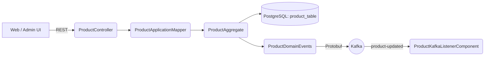
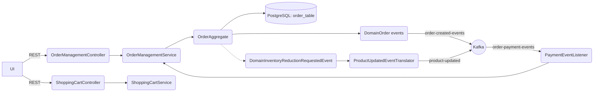
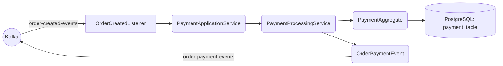

# Microservices Architecture - Online Store

## System Architecture Overview

This document describes the complete microservices architecture for the online store application based on the actual implementation, including all service interactions, message flows, and infrastructure components.

## Technology Stack

- **Language**: Java 17+
- **Framework**: Spring Boot 3.x
- **Build Tool**: Gradle
- **Databases**: PostgreSQL (per service)
- **Message Broker**: Apache Kafka with Schema Registry
- **Event Serialization**: Protocol Buffers (Protobuf)
- **ORM**: Hibernate/JPA
- **Database Migration**: Flyway
- **Frontend**: React
- **Containerization**: Docker, Docker Compose

## Service Maps (per microservice)

### Inventory / Product Service (port 8083)



Notes:
- Controller delegates to `ProductDomainService` via mapper; idempotency support persists to `product_create_request`.
- `ProductKafkaListenerComponent` consumes `product-updated` events with `INVENTORY_REDUCTION` markers to adjust stock.
- Categories are natural-ID cached (`CategoryEntityMapper` uses Hibernate simple natural ID).

### Order Service (port 8080)



Notes:
- Adding the same SKU merges quantities instead of erroring.
- `updateItemQuantity` emits inventory-reduction markers via `product-updated` topic for inventory service to consume.

### Payment Service (port 8084)



Notes:
- `PaymentProcessingService` deterministically maps `PaymentApplicationService` result to SUCCESSFUL/FAILED `OrderPaymentEvent`.


## Complete Order Processing Saga Flow

This is the actual implemented choreography-based saga for order processing with payment:


## Product Management Flow


## Shopping Cart Operations


## REST API Endpoints

### Product Microservice (Port 8083)

| Method | Endpoint | Description |
|--------|----------|-------------|
| GET | `/products/{sku}` | Get product by SKU |
| POST | `/products` | Create new product |
| PUT | `/products/{sku}` | Update product |
| GET | `/products/category/{categoryName}` | Get products by category (paginated) |
| GET | `/products/search?keyword={keyword}` | Search products |
| GET | `/products/{sku}/related` | Get related products |
| POST | `/products/{sku}/categories/{categoryName}` | Assign product to category |
| POST | `/products/{sku}/volume/reduce` | Reduce product inventory |
| POST | `/products/{sku}/volume/increase` | Increase product inventory |

### Order Microservice (Port 8080)

**Order Management:**
| Method | Endpoint | Description |
|--------|----------|-------------|
| POST | `/api/order` | Create new order |
| PUT | `/api/order/{orderId}/items` | Add items to order |
| PATCH | `/api/order/{orderId}/status` | Update order status |
| GET | `/api/order/customer/{customerId}` | Get customer orders |

**Shopping Cart:**
| Method | Endpoint | Description |
|--------|----------|-------------|
| GET | `/cart/{userId}` | Get shopping cart |
| POST | `/cart` | Add items to cart |
| PUT | `/cart/{userId}/{sku}` | Update item quantity |
| DELETE | `/cart/{userId}/{sku}` | Remove item from cart |
| DELETE | `/cart/{userId}` | Clear cart |

### Payment Microservice (Port 8084)

| Method | Endpoint | Description |
|--------|----------|-------------|
| POST | `/payments` | Create payment |
| POST | `/payments/{paymentId}/process` | Process payment |
| POST | `/payments/{paymentId}/retry` | Retry failed payment |
| POST | `/payments/{paymentId}/cancel` | Cancel payment |
| GET | `/payments/{paymentId}` | Get payment by ID |
| GET | `/payments/order/{orderId}` | Get payment by order ID |
| GET | `/payments/status/{status}` | Get payments by status |
| GET | `/payments/statistics` | Get payment statistics |

## Event Catalog

### Product Events

**ProductCreatedEvent**
```protobuf
message ProductCreatedEvent {
  string product_id = 1;
  string sku = 2;
  string title = 3;
  double price = 4;
  int32 volume = 5;
  int64 timestamp = 6;
}
```

**ProductUpdatedEvent**
```protobuf
message ProductUpdatedEvent {
  string product_id = 1;
  string sku = 2;
  string title = 3;
  double price = 4;
  int64 timestamp = 5;
}
```

### Order Events

**OrderCreatedEvent**
```protobuf
message OrderCreatedEvent {
  string order_id = 1;
  string customer_id = 2;
  repeated OrderItem items = 3;
  double total_amount = 4;
  string status = 5;
  int64 timestamp = 6;
}
```

**OrderPaymentEvent**
```protobuf
message OrderPaymentEvent {
  string order_id = 1;
  string payment_id = 2;
  string status = 3;  // SUCCESSFUL or FAILED
  double amount = 4;
  int64 timestamp = 5;
}
```

### Payment Events

**PaymentProcessedEvent** (Domain Event)
- Raised when payment succeeds
- Translated to OrderPaymentEvent for Kafka

**PaymentFailedEvent** (Domain Event)
- Raised when payment fails
- Translated to OrderPaymentEvent for Kafka

## Domain-Driven Design Architecture

### Aggregates

**Product Aggregate** (Inventory Microservice)
```
Product (Aggregate Root)
├── ProductId (Identity)
├── ProductSku (Value Object) - Unique identifier
├── ProductTitle (Value Object)
├── ProductDescription (Value Object)
├── Money (Value Object) - Price with VAT
├── Quantity (Value Object) - Stock quantity
├── ImageUrl (Value Object) - Product image
└── ProductCategory (Entity) - Many-to-many relationship

Business Rules:
- SKU must be unique across all products
- Price must be positive
- Volume cannot go negative
- Category assignment prevents duplicates
```

**Order Aggregate** (Order Microservice)
```
Order (Aggregate Root)
├── OrderId (Identity)
├── CustomerId (Value Object)
├── OrderStatus (Value Object) - CREATED, PAID, SHIPPED, DELIVERED, PAYMENT_FAILED
├── OrderItem (Entity) - Collection
│   ├── ProductId (Value Object)
│   ├── Quantity (Value Object)
│   └── Price (Money Value Object)
└── Total Amount (Money Value Object)

Business Rules:
- Status transitions are validated (CREATED → PAID → SHIPPED → DELIVERED)
- Cannot add items after order is PAID
- Quantity must be positive
- Total amount auto-calculated from items
```

**Payment Aggregate** (Payment Microservice)
```
Payment (Aggregate Root)
├── PaymentId (Identity)
├── OrderId (Value Object)
├── PaymentMethod (Value Object) - CREDIT_CARD, DEBIT_CARD, etc.
├── PaymentStatus (Value Object) - PENDING, SUCCESSFUL, FAILED, CANCELLED
├── Money (Value Object) - Amount
└── Transaction Details

Business Rules:
- Payment can only be processed once from PENDING
- Failed payments can be retried
- Successful payments cannot be modified
- Simulates 80% success rate for demo
```

### Layered Architecture

Each microservice follows clean architecture:

```
presentation/
├── controller/          # REST API controllers
└── dto/                 # Data Transfer Objects

application/
├── service/            # Application services (orchestration)
├── mapper/             # DTO ↔ Domain mapping
└── event/              # Event handlers & publishers

domain/
├── model/
│   ├── aggregate/      # Aggregate roots
│   ├── entity/         # Entities
│   └── valueobject/    # Value objects
├── service/            # Domain services
└── repository/         # Repository interfaces (ports)

infrastructure/
├── persistence/        # JPA implementations
│   ├── repository/     # Repository implementations
│   └── entity/         # JPA entities
├── messaging/          # Kafka producers/consumers
└── config/             # Configuration classes
```

### Shared Kernel

The `shared` module provides common domain building blocks:

**Base Classes:**
- `AggregateRoot<ID>` - Base for all aggregates
- `Entity<ID>` - Base for entities
- `ValueObject` - Base for value objects
- `DomainEvent` - Base for domain events
- `DomainObjectId` - Generic identifier

**Financial Domain:**
- `Money` - Monetary values with currency
- `VAT` - Value-added tax calculations

**Event Infrastructure:**
- `DomainEventPublisher` - Publishing interface
- `ProtobufDomainTranslator` - Domain events → Protobuf
- `DelegatingDomainEventTranslator` - Translator registry

## Kafka Infrastructure

### Broker Setup (docker-compose.yml)

```yaml
Services:
- Zookeeper (Port 2181)
- Kafka Broker (Ports 9092 internal, 9094 external)
- Schema Registry (Port 8081)
- Schema Registry UI (Port 8001)
- Kafka REST Proxy (Port 8082)
- Kafka Topics UI (Port 8000)
```

### Kafka Topics

| Topic Name | Publisher | Consumers | Event Type |
|------------|-----------|-----------|------------|
| `product-created` | Product MS | Product MS | ProductCreatedEvent |
| `product-updated` | Product MS | Product MS | ProductUpdatedEvent |
| `order-created-events` | Order MS | Payment MS | OrderCreatedEvent |
| `order-updated` | Order MS | - | OrderStatusChangedEvent |
| `order-payment-events` | Payment MS | Order MS | OrderPaymentEvent |

### Serialization

- **Format**: Protocol Buffers (Protobuf)
- **Serializer**: `KafkaProtobufSerializer`
- **Deserializer**: `KafkaProtobufDeserializer`
- **Schema Registry**: Confluent Schema Registry
- **Schema Evolution**: Backward and forward compatible

### Kafka Configuration

**Producer:**
```java
enable.idempotence=true
acks=all
key.serializer=StringSerializer
value.serializer=KafkaProtobufSerializer
```

**Consumer:**
```java
enable.auto.commit=false
isolation.level=read_committed
value.deserializer=ErrorHandlingDeserializer
spring.json.use.type.headers=false
```

## Database Configuration

### PostgreSQL Instances

**Product Database (bookstore)**
- Port: 5432
- Schema: bookstore
- Tables:
  - `product_table` - Product aggregate data
  - `categories` - Product categories
  - `product_category_map` - Product-category mapping

**Order Database (bookstore-order)**
- Port: 5433
- Schema: bookstore-order
- Tables:
  - `orders` - Order aggregate data
  - `order_items` - Order line items

**Payment Database**
- Managed by Flyway migrations
- Tables:
  - Payment transaction data

### ORM & Caching

- **ORM**: Hibernate/JPA
- **Connection Pool**: HikariCP
- **2nd Level Cache**: Hibernate + Caffeine
- **Migrations**: Flyway

## Communication Patterns

### Synchronous (REST)
- **Client ↔ Microservices**: HTTP/REST
- **Use Cases**: Read operations, immediate responses
- **Protocol**: JSON over HTTP

### Asynchronous (Events)
- **Microservice ↔ Microservice**: Kafka events
- **Use Cases**: State changes, long-running operations, saga coordination
- **Protocol**: Protobuf over Kafka
- **Pattern**: Event choreography (no orchestrator)

### No Direct Service Calls
- Microservices never call each other directly via HTTP
- All inter-service communication via Kafka events
- Enables loose coupling and independent scaling

## Data Consistency

### Eventual Consistency
- State propagated through events
- Services maintain their own data
- No distributed transactions

### Transactional Outbox
- Domain events published within transaction
- Ensures consistency between database writes and event publishing

### Idempotent Consumers
- Event handlers designed for at-least-once delivery
- Duplicate events handled gracefully

## Saga Pattern Implementation

### Order-Payment Choreography Saga

**Happy Path:**
1. User creates order → Order status: CREATED
2. OrderCreatedEvent published
3. Payment service consumes event → Processes payment
4. PaymentProcessedEvent published (80% chance)
5. Order service consumes event → Order status: PAID
6. Order can proceed to SHIPPED → DELIVERED

**Compensation Path:**
1. Payment fails (20% chance)
2. PaymentFailedEvent published
3. Order service consumes event → Order status: PAYMENT_FAILED
4. User notified to retry payment or cancel

### Saga Characteristics
- **Type**: Choreography-based (no central coordinator)
- **Compensation**: Automatic on payment failure
- **Idempotency**: All event handlers are idempotent
- **Audit Trail**: All events stored in Kafka for replay

## Resilience Patterns

### Retry Pattern
```java
@RetryableTopic(
    attempts = "3",
    backoff = @Backoff(delay = 1000, multiplier = 2.0)
)
```

### Transaction Management
```java
@Transactional
public void handleEvent() {
    // Database operations + event publishing
    // All-or-nothing semantics
}
```

### Error Handling
- `ErrorHandlingDeserializer` for Kafka
- Dead letter topics for failed messages
- Circuit breaker pattern (can be added)

## Testing Strategy

### Unit Tests
- Domain logic (aggregates, value objects, entities)
- Value object validations
- Business rule enforcement

### Integration Tests
- Repository tests with TestContainers
- Kafka event publishing/consuming
- REST API endpoints
- End-to-end order flow

### Test Fixtures
- Shared test utilities in `shared-test` module
- Test data builders
- In-memory repositories for fast tests

## Development Environment

### Local Setup
```bash
# Start infrastructure
docker-compose up -d

# Start microservices
./gradlew :inventory-microservice:bootRun    # Port 8083
./gradlew :order-microservice:bootRun        # Port 8080
./gradlew :payment-microservice:bootRun      # Port 8084

# Start frontend
cd frontend && npm start                      # Port 3000
```

### Docker Setup
```bash
# Build all services
docker-compose build

# Start all services
docker-compose up -d

# View logs
docker-compose logs -f <service-name>
```

## System Characteristics

### Scalability
- Each microservice can scale independently
- Kafka partitioning enables horizontal scaling
- Stateless services (except shopping cart in-memory)

### Fault Tolerance
- Kafka message persistence
- Retry mechanisms
- Graceful degradation on service failures

### Observability
- Structured logging
- Kafka message tracing
- Health check endpoints (Spring Boot Actuator)

## Future Enhancements

### Planned (Not Yet Implemented)
- API Gateway (Spring Cloud Gateway)
- Service Discovery (Eureka)
- Centralized Configuration (Spring Cloud Config)
- Redis for distributed caching and cart persistence
- Notification Service (email, SMS)
- User/Authentication Service (OAuth2/JWT)
- Monitoring Stack (Prometheus, Grafana, ELK, Jaeger)
- Shipping Service
- Inventory reservation on order creation

### Architecture Evolution
- Event sourcing for complete audit trail
- CQRS for read/write separation
- Service mesh for advanced traffic management
- GraphQL API gateway for flexible queries
