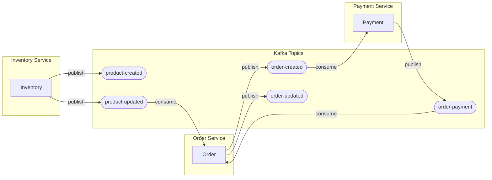

# Event Schemas

All events use Protocol Buffers. Schema files are in `shared-kernel/src/main/proto/`.

## Topic Flow Diagram



## OrderCreatedEvent

Published when an order is created.

```protobuf
message OrderCreatedEvent {
  string id = 1;
  Status status = 3;
  google.protobuf.Timestamp create_time = 7;
  optional google.protobuf.Timestamp update_time = 8;
  string userId = 10;
  repeated OrderItem items = 11;

  message OrderItem {
    string sku = 1;
    string product_title = 2;
    double quantity = 3;
    double price = 4;
    string currency = 5;
  }

  enum Status {
    CREATED = 0;
    PENDING_PAYMENT = 1;
    PAID = 2;
    PAYMENT_FAILED = 3;
    PROCESSING = 4;
    SHIPPED = 5;
    DELIVERED = 6;
    CANCELLED = 7;
  }
}
```

**Topic:** `order-created`  
**Producer:** Order Service  
**Consumer:** Payment Service

---

## OrderPaymentUpdatedEvent

Published when payment status changes.

```protobuf
message OrderPaymentUpdatedEvent {
  string id = 1;
  google.protobuf.Timestamp updated_time = 2;
  string userId = 3;
  string sku = 4;
  string paymentId = 5;
  string orderId = 6;
  Status status = 7;
  string errorMessage = 8;
}
```

**Topic:** `order-payment`  
**Producer:** Payment Service  
**Consumer:** Order Service

---

## OrderUpdatedEvent

Published when order state changes.

**Topic:** `order-updated`  
**Producer:** Order Service

---

## ProductCreatedEvent

Published when a product is created.

**Topic:** `product-created`  
**Producer:** Inventory Service

---

## ProductUpdatedEvent

Published when product details change.

**Topic:** `product-updated`  
**Producer:** Inventory Service  
**Consumer:** Order Service

---

## Kafka Configuration

- **Bootstrap servers:** `kafka1:9092` (internal) / `localhost:9094` (external)
- **Schema Registry:** `http://localhost:8081`
- **Serialization:** Protobuf with Confluent Schema Registry
- **Consumer group pattern:** `{service-name}-group`
