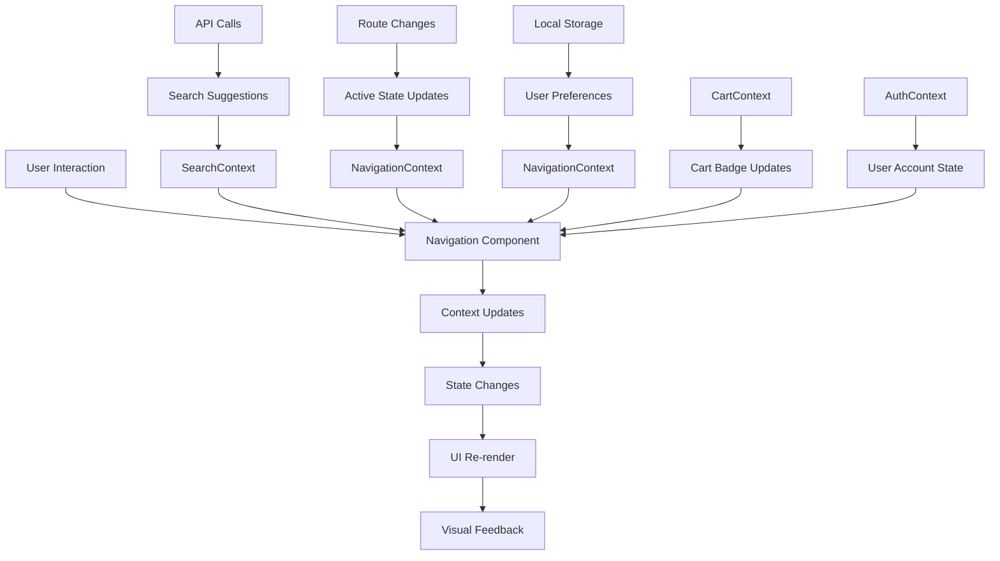

# Design Document: Professional E-Commerce Navigation System

## Overview

This design document outlines the implementation of a modern, professional e-commerce navigation and header system that provides an enhanced user experience with advanced search capabilities, multi-level navigation, and comprehensive mobile support. The system will enhance the existing navigation with a more sophisticated solution that matches industry-leading e-commerce platforms ASOS, and Net-A-Porter.

The design focuses on creating a dual-tier navigation structure: a top bar for brand identity and user actions, and a main navigation bar for gender categories and search functionality. The system will provide intelligent search with an inbox-style interface, comprehensive user account management with Plus membership integration, and a fully responsive mobile experience that maintains feature parity with desktop.

**Key Enhancements:**
- Gender-based navigation (Women/Men/Kids) with subcategory dropdowns
- Advanced search inbox with recent searches, suggestions, and trending items
- Enhanced user account dropdown with Plus membership integration
- Language switcher with RTL support
- Mobile-first responsive design with full-screen navigation
- Integration with existing React Context (Cart, Auth) and React Router
- Property-based testing for comprehensive correctness validation

## Architecture

### Component Hierarchy

```
NavigationSystem
├── TopBar
│   ├── BrandLogo
│   ├── UserActions
│   │   ├── AccountDropdown
│   │   │   ├── AccountLinks
│   │   │   ├── PlusMembershipBadge (conditional)
│   │   │   └── SignOutSection
│   │   ├── WishlistIcon
│   │   └── ShoppingCartIcon (with badge)
│   └── LanguageSwitcher
├── MainNavigation
│   ├── GenderNavigation
│   │   ├── WomenCategory (with subcategory dropdown)
│   │   ├── MenCategory (with subcategory dropdown)
│   │   └── KidsCategory (with subcategory dropdown)
│   └── SearchInbox
│       ├── SearchInput
│       ├── SearchSuggestions
│       ├── RecentSearches
│       ├── TrendingItems
│       └── PopularCategories
└── MobileNavigation
    ├── MobileHeader (with hamburger menu)
    ├── MobileSearchInbox (full-screen)
    ├── MobileGenderNavigation
    ├── MobileCategoryMenu
    └── MobileUserActions

NavigationContext (new)
├── NavigationState
├── SearchState  
├── UserPreferences
└── MobileMenuState

SearchContext (new)
├── SearchHistory
├── SearchSuggestions
├── TrendingData
└── SearchAnalytics
```

### State Management Integration

The navigation system will integrate with existing and new React Context providers:

**Existing Contexts:**
- **CartContext**: For shopping cart state and item counts
- **AuthContext**: For user authentication and account information

**New Contexts:**
- **NavigationContext**: Navigation state, active categories, mobile menu state, and user preferences
- **SearchContext**: Search state, recent searches, suggestions, and trending data

### Technology Stack Integration

**React 18.3.1 + TypeScript 5.3.3:**
- Functional components with hooks for state management
- TypeScript interfaces for type safety
- React.memo for performance optimization of navigation components

**Styling with Bootstrap 5.3.3 + Custom CSS:**
- Bootstrap utility classes for responsive layout
- Custom CSS with design tokens for brand-specific styling
- CSS custom properties for theme consistency

**React Router DOM 6.21.0:**
- Integration with existing routing for navigation actions
- Active state management based on current route
- Programmatic navigation for search and category selection

**fast-check 4.5.3:**
- Property-based testing for navigation behavior
- Random data generation for comprehensive test coverage
- Universal property validation across all user interactions

### Data Flow



## Components and Interfaces

### Enhanced Navigation Types

Building on the existing `User`, `Category`, and `Cart` types from `src/types/index.ts`, we'll add new interfaces for the enhanced navigation system:

```typescript
// Extending existing User interface for Plus membership
interface EnhancedUser extends User {
  isPlusMember: boolean;
  preferences: UserPreferences;
  membershipTier?: 'plus' | 'premium';
  memberSince?: string;
}

interface UserPreferences {
  language: string;
  currency: string;
  preferredGender: 'women' | 'men' | 'kids' | null;
  sizePreferences: SizePreference[];
  favoriteCategories: string[];
  notifications: NotificationSettings;
}

interface NavigationState {
  activeGender: 'women' | 'men' | 'kids' | null;
  activeCategory: string | null;
  isMobileMenuOpen: boolean;
  isSearchFocused: boolean;
  searchQuery: string;
  recentSearches: string[];
  language: string;
  isAccountDropdownOpen: boolean;
  isLanguageDropdownOpen: boolean;
}

interface SearchInboxState {
  isOpen: boolean;
  suggestions: SearchSuggestion[];
  recentSearches: string[];
  trendingItems: TrendingItem[];
  popularCategories: Category[];
  isLoading: boolean;
  hasError: boolean;
  errorMessage?: string;
}

interface GenderCategory extends Category {
  subcategories: SubCategory[];
  featured: FeaturedItem[];
  imageUrl?: string;
  gender: 'women' | 'men' | 'kids';
}

interface SubCategory {
  id: string;
  name: string;
  items: CategoryItem[];
  imageUrl?: string;
  parentGender: 'women' | 'men' | 'kids';
  sortOrder: number;
}

interface Language {
  code: string;
  name: string;
  nativeName: string;
  flag: string;
  rtl: boolean;
  enabled: boolean;
}
```

### Component Interfaces

Leveraging the existing project structure with path aliases and component patterns:

```typescript
// Main Navigation Component Props
interface NavigationProps {
  genderCategories?: GenderCategory[];
  languages?: Language[];
  onSearch?: (query: string) => void;
  onCategorySelect?: (categoryId: string, gender?: string) => void;
  onGenderSelect?: (gender: 'women' | 'men' | 'kids') => void;
  className?: string;
}

// Top Bar Component Props
interface TopBarProps {
  user?: EnhancedUser;
  cartItemCount: number;
  wishlistItemCount: number;
  currentLanguage: string;
  availableLanguages: Language[];
  onLanguageChange: (language: string) => void;
  onAccountAction: (action: string) => void;
}

// Search Inbox Component Props
interface SearchInboxProps {
  isOpen: boolean;
  query: string;
  suggestions: SearchSuggestion[];
  recentSearches: string[];
  trendingItems: TrendingItem[];
  popularCategories: Category[];
  isLoading: boolean;
  isMobile?: boolean;
  onQueryChange: (query: string) => void;
  onSearch: (query: string) => void;
  onSuggestionSelect: (suggestion: SearchSuggestion) => void;
  onRecentSearchSelect: (search: string) => void;
  onClear: () => void;
}

// Gender Navigation Component Props
interface GenderNavigationProps {
  categories: GenderCategory[];
  activeGender: string | null;
  onGenderSelect: (gender: 'women' | 'men' | 'kids') => void;
  onSubcategorySelect: (subcategory: SubCategory) => void;
  isMobile?: boolean;
}

// Mobile Navigation Component Props
interface MobileNavigationProps {
  isOpen: boolean;
  genderCategories: GenderCategory[];
  user?: EnhancedUser;
  cartItemCount: number;
  wishlistItemCount: number;
  currentLanguage: string;
  availableLanguages: Language[];
  onClose: () => void;
  onGenderSelect: (gender: 'women' | 'men' | 'kids') => void;
  onCategorySelect: (category: Category) => void;
  onLanguageChange: (language: string) => void;
  onUserAction: (action: string) => void;
}

// Account Dropdown Component Props
interface AccountDropdownProps {
  user?: EnhancedUser;
  isOpen: boolean;
  onClose: () => void;
  onSignOut: () => void;
  onNavigate: (path: string) => void;
}
```

### Search System Design

Enhanced search system with comprehensive suggestion and analytics support:

```typescript
interface SearchSuggestion {
  id: string;
  type: 'product' | 'category' | 'brand' | 'query' | 'trending';
  text: string;
  category?: string;
  gender?: 'women' | 'men' | 'kids';
  imageUrl?: string;
  price?: number;
  originalPrice?: number;
  matchedText: string;
  popularity: number;
  isSponsored?: boolean;
}

interface TrendingItem {
  id: string;
  title: string;
  category: string;
  gender?: 'women' | 'men' | 'kids';
  searchCount: number;
  trend: 'up' | 'down' | 'stable';
  imageUrl?: string;
}

interface SearchInboxData {
  suggestions: SearchSuggestion[];
  recentSearches: string[];
  trendingItems: TrendingItem[];
  popularCategories: Category[];
  featuredBrands: Brand[];
  seasonalSuggestions: SeasonalSuggestion[];
}

interface SearchHistory {
  userId?: string;
  searches: SearchEntry[];
  maxEntries: number;
  lastCleanup: Date;
}

interface SearchEntry {
  query: string;
  timestamp: Date;
  resultCount: number;
  clicked: boolean;
  category?: string;
  gender?: string;
}

interface SearchAnalytics {
  popularQueries: PopularQuery[];
  trendingCategories: string[];
  seasonalTrends: SeasonalTrend[];
  userBehavior: UserSearchBehavior;
}
```

## Data Models

### Navigation Configuration

Extending the existing project structure with enhanced navigation data models:

```typescript
interface NavigationConfig {
  genderCategories: GenderCategory[];
  languages: Language[];
  searchConfig: SearchConfig;
  mobileConfig: MobileConfig;
  plusMembershipConfig: PlusMembershipConfig;
  accessibilityConfig: AccessibilityConfig;
}

interface GenderCategory {
  id: string;
  name: string;
  gender: 'women' | 'men' | 'kids';
  subcategories: SubCategory[];
  featured: FeaturedItem[];
  imageUrl?: string;
  description?: string;
  sortOrder: number;
  isActive: boolean;
  seoMetadata?: SEOMetadata;
}

interface SubCategory {
  id: string;
  name: string;
  parentGender: 'women' | 'men' | 'kids';
  items: CategoryItem[];
  imageUrl?: string;
  description?: string;
  sortOrder: number;
  isPopular?: boolean;
  isNew?: boolean;
}

interface CategoryItem {
  id: string;
  name: string;
  path: string;
  imageUrl?: string;
  isPopular?: boolean;
  isNew?: boolean;
  productCount?: number;
}

interface Language {
  code: string; // ISO 639-1 code (e.g., 'en', 'de', 'fr')
  name: string; // English name
  nativeName: string; // Native name
  flag: string; // Flag emoji or URL
  rtl: boolean; // Right-to-left language
  enabled: boolean;
  region?: string; // Optional region code
  currency?: string; // Default currency for this language
}

interface SearchConfig {
  maxSuggestions: number;
  maxRecentSearches: number;
  debounceMs: number;
  minQueryLength: number;
  enableTrending: boolean;
  enableAnalytics: boolean;
  cacheTimeout: number;
}

interface MobileConfig {
  breakpoint: number; // px
  enableSwipeGestures: boolean;
  animationDuration: number; // ms
  touchOptimization: boolean;
}

interface PlusMembershipConfig {
  badgeText: string;
  badgeColor: string;
  exclusiveFeatures: string[];
  upgradePrompts: UpgradePrompt[];
}
```

### Enhanced User Account Model

Building on the existing `User` interface from `src/types/index.ts`:

```typescript
interface EnhancedUser extends User {
  isPlusMember: boolean;
  membershipTier?: 'plus' | 'premium';
  memberSince?: string;
  preferences: UserPreferences;
  addresses: Address[];
  paymentMethods: PaymentMethod[];
  orderHistory: Order[];
  wishlist: Product[];
  recentlyViewed: Product[];
  loyaltyPoints?: number;
  avatar?: string;
}

interface UserPreferences {
  language: string;
  currency: string;
  preferredGender: 'women' | 'men' | 'kids' | null;
  sizePreferences: SizePreference[];
  favoriteCategories: string[];
  favoriteColors: string[];
  priceRange: PriceRange;
  notifications: NotificationSettings;
  accessibility: AccessibilitySettings;
  privacy: PrivacySettings;
}

interface SizePreference {
  category: string; // 'clothing', 'shoes', etc.
  size: string;
  fit: 'tight' | 'regular' | 'loose';
  verified: boolean;
}

interface NotificationSettings {
  email: boolean;
  push: boolean;
  sms: boolean;
  marketing: boolean;
  orderUpdates: boolean;
  priceAlerts: boolean;
  restockAlerts: boolean;
}

interface AccessibilitySettings {
  highContrast: boolean;
  reducedMotion: boolean;
  largeText: boolean;
  screenReader: boolean;
  keyboardNavigation: boolean;
}
```

### Search Data Models

Enhanced search system with comprehensive analytics and personalization:

```typescript
interface SearchHistory {
  userId?: string;
  searches: SearchEntry[];
  maxEntries: number;
  lastCleanup: Date;
  preferences: SearchPreferences;
}

interface SearchEntry {
  query: string;
  timestamp: Date;
  resultCount: number;
  clicked: boolean;
  clickedResults: string[];
  category?: string;
  gender?: string;
  filters?: SearchFilters;
  sessionId: string;
}

interface SearchPreferences {
  autoComplete: boolean;
  saveHistory: boolean;
  personalizedResults: boolean;
  trendingEnabled: boolean;
  maxHistoryDays: number;
}

interface SearchAnalytics {
  popularQueries: PopularQuery[];
  trendingCategories: TrendingCategory[];
  seasonalTrends: SeasonalTrend[];
  userBehavior: UserSearchBehavior;
  performanceMetrics: SearchPerformanceMetrics;
}

interface PopularQuery {
  query: string;
  count: number;
  trend: 'up' | 'down' | 'stable';
  categories: string[];
  avgResultCount: number;
  clickThroughRate: number;
}

interface TrendingCategory {
  categoryId: string;
  name: string;
  searchVolume: number;
  trend: number; // percentage change
  timeframe: 'hour' | 'day' | 'week' | 'month';
}

interface SeasonalTrend {
  keyword: string;
  season: 'spring' | 'summer' | 'fall' | 'winter';
  peakMonth: number;
  searchMultiplier: number;
}

interface UserSearchBehavior {
  avgSessionDuration: number;
  avgQueriesPerSession: number;
  topCategories: string[];
  preferredFilters: SearchFilters;
  conversionRate: number;
}
```

## Correctness Properties

*A property is a characteristic or behavior that should hold true across all valid executions of a system—essentially, a formal statement about what the system should do. Properties serve as the bridge between human-readable specifications and machine-verifiable correctness guarantees.*

### Property Reflection

After analyzing all acceptance criteria, I identified several areas where properties can be consolidated to eliminate redundancy:

- **Cart and Wishlist State Properties**: Properties for cart badge display, empty cart handling, and real-time updates can be combined into comprehensive cart state management properties
- **Search Inbox Properties**: Properties for search activation, expansion, and real-time suggestions can be consolidated into search interaction properties  
- **Language Management Properties**: Properties for language display, selection, and content updates can be combined into language management properties
- **Mobile Responsive Properties**: Properties for mobile menu behavior, full-screen navigation, and feature parity can be consolidated into mobile behavior properties
- **Context Integration Properties**: Properties for router integration, context connection, and state synchronization can be combined into system integration properties
- **Plus Membership Properties**: Properties for membership display, exclusive content, and upgrade prompts can be consolidated into membership management properties

### Core Properties

Property 1: **Gender Category Hover Interaction**
*For any* gender category in the navigation, hovering over it should display the relevant subcategories in a dropdown menu
**Validates: Requirements 1.2**

Property 2: **Gender Selection State Management**
*For any* gender category selection, the navigation system should update its state to filter all subsequent navigation to that gender context
**Validates: Requirements 1.3**

Property 3: **Subcategory Organization**
*For any* set of subcategories, they should be organized by logical groupings (Clothing, Shoes, Accessories, etc.) when displayed
**Validates: Requirements 1.4**

Property 4: **Cart State Display Management**
*For any* shopping cart state, the navigation should display the correct item count as a badge when items exist, no badge when empty, and update counts immediately when items are added or removed
**Validates: Requirements 2.3, 4.1, 4.2, 4.4**

Property 5: **Account Dropdown Interaction**
*For any* user hovering over the account icon, the system should display a dropdown menu with account options
**Validates: Requirements 3.1**

Property 6: **Plus Membership Management**
*For any* user with Plus membership status, the navigation should display membership-specific indicators, exclusive content, and benefits, while non-Plus users should see appropriate upgrade prompts
**Validates: Requirements 3.3, 7.1, 7.2, 7.3, 7.4, 7.5**

Property 7: **User Information Display**
*For any* authenticated user, the account menu should display the current user's email address and provide access to all required account links
**Validates: Requirements 3.2, 3.4, 3.5**

Property 8: **State Persistence Across Navigation**
*For any* page navigation, the shopping cart and wishlist counts should remain consistent and maintain state
**Validates: Requirements 4.3, 4.5**

Property 9: **Search Inbox Interaction Management**
*For any* interaction with the search input (click or focus), the search component should expand to show the full search inbox interface with recent searches, trending items, and suggestions
**Validates: Requirements 5.1, 5.2, 5.3**

Property 10: **Real-time Search Functionality**
*For any* text input in the search field, the system should provide real-time product suggestions and category matches, with appropriate fallback behavior when no results are found
**Validates: Requirements 5.4, 5.8**

Property 11: **Search Keyboard Navigation**
*For any* search inbox state, users should be able to navigate through all elements using keyboard controls (arrow keys, enter, escape)
**Validates: Requirements 5.5**

Property 12: **Mobile Search Experience**
*For any* mobile device viewport, the search component should provide a full-screen search inbox experience with the same functionality as desktop
**Validates: Requirements 5.6, 8.4**

Property 13: **Search Persistence**
*For any* search query, the system should persist recent searches in local storage and display them in future search sessions
**Validates: Requirements 5.7**

Property 14: **Language Management System**
*For any* language selection, the system should display the current language, show available options when clicked, update all text content immediately when changed, maintain preferences across sessions, and support RTL languages with appropriate layout adjustments
**Validates: Requirements 6.1, 6.2, 6.3, 6.4, 6.5**

Property 15: **Mobile Responsive Behavior**
*For any* mobile device viewport, the navigation should replace desktop navigation with a hamburger menu, provide full-screen navigation with touch-optimized interactions, and maintain all desktop functionality in a mobile-appropriate format
**Validates: Requirements 8.1, 8.2, 8.6**

Property 16: **Mobile Menu Content Organization**
*For any* mobile menu state, it should include a prominent search inbox at the top and organize categories in a scrollable list with clear visual hierarchy
**Validates: Requirements 8.3, 8.5**

Property 17: **Accessibility Support**
*For any* interactive element in the navigation, it should support keyboard navigation, provide appropriate ARIA labels and roles, and adapt to high contrast mode and reduced motion preferences
**Validates: Requirements 9.1, 9.2, 9.5**

Property 18: **Performance Requirements**
*For any* page load, the navigation system should display within 200ms
**Validates: Requirements 9.3**

Property 19: **System Integration**
*For any* navigation action, the system should integrate with React Router for navigation, connect to existing cart and authentication contexts, update active states when routes change, and handle loading states gracefully
**Validates: Requirements 10.1, 10.2, 10.3, 10.5**

Property 20: **Preference Persistence**
*For any* user preference (language, gender selection), the system should persist the data in local storage
**Validates: Requirements 10.4**

## Error Handling

### Search Error Handling

The search system will implement comprehensive error handling for various failure scenarios, integrating with the existing project's error handling patterns:

```typescript
interface SearchErrorState {
  type: 'network' | 'timeout' | 'server' | 'validation' | 'quota_exceeded';
  message: string;
  retryable: boolean;
  fallbackData?: SearchInboxData;
  timestamp: Date;
  errorCode?: string;
}

interface NavigationErrorBoundary {
  hasError: boolean;
  error?: Error;
  errorInfo?: ErrorInfo;
  fallbackComponent: React.ComponentType;
  onError: (error: Error, errorInfo: ErrorInfo) => void;
}
```

**Network Failures**: When search API calls fail due to network issues, the system will:
- Display cached recent searches and trending items from local storage
- Show a subtle error indicator without disrupting the user experience
- Implement automatic retry with exponential backoff (100ms, 200ms, 400ms, 800ms)
- Provide manual retry option for users with clear messaging
- Gracefully degrade to basic search functionality using client-side filtering

**Timeout Handling**: For slow search responses:
- Set reasonable timeout limits (3 seconds for suggestions, 5 seconds for full search)
- Display loading states during network requests using existing design tokens
- Fall back to cached data when timeouts occur
- Maintain responsive UI even during slow network conditions
- Log timeout events for performance monitoring

**Server Errors**: When the search API returns errors:
- Log errors for monitoring and debugging using existing error reporting
- Display user-friendly error messages with actionable guidance
- Provide alternative search options (recent searches, popular categories)
- Gracefully degrade to basic search functionality
- Implement circuit breaker pattern to prevent cascading failures

**Quota and Rate Limiting**: When API limits are exceeded:
- Display appropriate messaging about temporary limitations
- Fall back to cached suggestions and recent searches
- Implement client-side debouncing to reduce API calls
- Provide offline search capabilities using cached data

### Navigation State Errors

**Context Connection Failures**: If the navigation cannot connect to required contexts:
- Implement fallback state management using local component state
- Display warning messages for developers in development mode
- Ensure core navigation functionality remains available
- Provide recovery mechanisms when contexts become available
- Use React Error Boundaries to contain context-related errors

**Route Integration Errors**: When React Router integration fails:
- Fall back to basic link navigation using window.location
- Log routing errors for debugging with stack traces
- Maintain navigation functionality without advanced routing features
- Provide clear error boundaries to prevent application crashes
- Implement graceful degradation for navigation actions

**Local Storage Errors**: When local storage is unavailable or full:
- Fall back to session storage for temporary data
- Implement in-memory storage as final fallback
- Gracefully handle storage quota exceeded errors
- Provide user messaging about reduced functionality
- Clear old data automatically to free up space

### Mobile-Specific Error Handling

**Touch Interaction Failures**: For mobile touch events:
- Implement fallback click handlers for touch events
- Provide visual feedback for all touch interactions
- Handle edge cases like accidental touches and gesture conflicts
- Ensure accessibility for users with motor impairments
- Test thoroughly across different devices and orientations

**Viewport Detection Issues**: When responsive breakpoints fail:
- Implement JavaScript-based viewport detection as fallback
- Provide manual mobile/desktop mode toggle for users
- Ensure navigation remains functional across all screen sizes
- Test thoroughly across different devices and orientations
- Use CSS media queries as primary detection method

**Performance Issues on Mobile**: When mobile performance degrades:
- Implement performance monitoring and alerting
- Provide reduced animation modes for slower devices
- Use lazy loading for non-critical navigation components
- Optimize touch targets for better usability
- Implement progressive enhancement patterns

### Plus Membership Error Handling

**Membership Status Verification Failures**: When Plus membership cannot be verified:
- Fall back to non-Plus member experience
- Display appropriate messaging about temporary limitations
- Retry membership verification in background
- Log verification failures for investigation
- Provide manual refresh option for users

**Exclusive Content Loading Errors**: When Plus-exclusive content fails to load:
- Display fallback content with appropriate messaging
- Implement retry mechanisms for content loading
- Gracefully degrade to standard member experience
- Log content loading failures for monitoring
- Provide clear error messaging to Plus members

### Accessibility Error Handling

**Screen Reader Compatibility Issues**: When screen reader support fails:
- Ensure all interactive elements have fallback text
- Provide alternative navigation methods
- Log accessibility errors for investigation
- Test thoroughly with actual screen reader software
- Implement progressive enhancement for accessibility features

**Keyboard Navigation Failures**: When keyboard navigation breaks:
- Ensure all interactive elements remain focusable
- Provide alternative keyboard shortcuts
- Display keyboard navigation help when needed
- Test thoroughly across different browsers and devices
- Implement focus management best practices

## Testing Strategy

### Dual Testing Approach

The navigation system will employ both unit testing and property-based testing to ensure comprehensive coverage and correctness, following the existing project's testing patterns with Vitest and fast-check:

**Unit Tests**: Focus on specific examples, edge cases, and integration points
- Component rendering with different props and states using React Testing Library
- User interaction handling (clicks, hovers, keyboard events) with realistic scenarios
- Integration with React Router and Context providers (CartContext, AuthContext)
- Error boundary behavior and fallback states for robust error handling
- Accessibility features and ARIA attributes for screen reader compatibility
- Mobile-specific interactions and responsive behavior across breakpoints
- Plus membership conditional rendering and upgrade prompts
- Language switching functionality and RTL layout support

**Property-Based Tests**: Verify universal properties across all inputs using fast-check
- Search functionality with randomly generated queries and suggestion data
- Navigation state management with various user actions and state transitions
- Responsive behavior across different viewport sizes and device orientations
- Language switching with different locale configurations and content updates
- Cart and wishlist state updates with random item counts and user actions
- Gender category navigation with randomly generated category structures
- User account dropdown behavior with different user states and membership levels
- Mobile menu interactions with various touch gestures and navigation patterns

### Property-Based Testing Configuration

The testing strategy will use **fast-check 4.5.3** for property-based testing with the following configuration:
- **Minimum 100 iterations** per property test to ensure comprehensive coverage through randomization
- Each property test will reference its corresponding design document property for traceability
- Tag format: **Feature: navigation, Property {number}: {property_text}**
- Integration with existing Vitest 3.2.4 test runner and jsdom environment
- Custom generators for navigation-specific data types (categories, users, search queries)

### Test Categories

**Component Integration Tests**:
- Navigation system integration with existing CartContext and AuthContext
- Search component integration with API services using Axios 1.7.7
- Mobile menu integration with touch events and gesture handling
- Language switcher integration with internationalization system
- Plus membership integration with user account management
- Router integration with React Router DOM 6.21.0 for navigation actions

**User Experience Tests**:
- Search inbox behavior with various query types, lengths, and result sets
- Mobile navigation flow from hamburger menu to category selection
- Account dropdown functionality with different user states and membership levels
- Cart and wishlist updates with real-time state synchronization
- Gender category navigation with subcategory dropdown interactions
- Language switching with immediate content updates and layout adjustments

**Performance Tests**:
- Navigation rendering performance within 200ms requirement using performance.now()
- Search suggestion response times under various network conditions
- Mobile menu animation performance on different devices and browsers
- Memory usage during extended navigation sessions and state updates
- Bundle size impact of navigation components on overall application size

**Accessibility Tests**:
- Keyboard navigation through all interactive elements using Tab, Enter, Escape
- Screen reader compatibility with ARIA labels, roles, and live regions
- High contrast mode support and visual accessibility compliance
- Reduced motion preference handling for animations and transitions
- Touch target sizes meeting minimum 44px accessibility requirements

**Responsive Design Tests**:
- Mobile breakpoint behavior at various screen sizes (320px to 1400px+)
- Touch interaction optimization for mobile devices and tablets
- Desktop hover states and mouse interaction patterns
- Cross-browser compatibility across Chrome, Firefox, Safari, and Edge
- Device orientation changes and viewport adjustments

### Testing Implementation

Each correctness property will be implemented as a single property-based test following the existing project structure:

```typescript
// Example property test structure using fast-check and Vitest
describe('Feature: navigation', () => {
  it('Property 4: Cart State Display Management - For any shopping cart state, navigation should display correct item count', () => {
    fc.assert(fc.property(
      fc.integer({ min: 0, max: 999 }), // Generate random cart counts
      fc.boolean(), // Generate random wishlist states
      (itemCount, hasWishlistItems) => {
        const mockUser = createMockUser({ isPlusMember: fc.sample(fc.boolean(), 1)[0] });
        const { getByTestId, queryByTestId } = render(
          <CartProvider userId="test-user">
            <AuthProvider initialUser={mockUser}>
              <BrowserRouter>
                <Navigation 
                  cartItemCount={itemCount}
                  wishlistItemCount={hasWishlistItems ? 5 : 0}
                />
              </BrowserRouter>
            </AuthProvider>
          </CartProvider>
        );
        
        // Verify cart badge behavior
        if (itemCount > 0) {
          expect(getByTestId('cart-badge')).toHaveTextContent(itemCount.toString());
          expect(getByTestId('cart-badge')).toBeVisible();
        } else {
          expect(queryByTestId('cart-badge')).toBeNull();
        }
        
        // Verify immediate updates when cart changes
        const addToCartButton = getByTestId('add-to-cart-test-button');
        fireEvent.click(addToCartButton);
        
        // Cart count should update immediately
        expect(getByTestId('cart-badge')).toHaveTextContent((itemCount + 1).toString());
      }
    ), { numRuns: 100 });
  });

  it('Property 9: Search Inbox Interaction Management - For any search interaction, component should expand with full inbox', () => {
    fc.assert(fc.property(
      fc.string({ minLength: 0, maxLength: 50 }), // Generate random search queries
      fc.array(fc.string({ minLength: 1, maxLength: 30 }), { maxLength: 10 }), // Generate suggestions
      (searchQuery, suggestions) => {
        const { getByTestId, queryByTestId } = render(
          <BrowserRouter>
            <Navigation />
          </BrowserRouter>
        );
        
        const searchInput = getByTestId('search-input');
        
        // Test focus interaction
        fireEvent.focus(searchInput);
        expect(queryByTestId('search-suggestions')).toBeInTheDocument();
        
        // Test typing interaction
        fireEvent.change(searchInput, { target: { value: searchQuery } });
        
        if (searchQuery.length > 2) {
          expect(queryByTestId('search-suggestions')).toBeInTheDocument();
        }
        
        // Test keyboard navigation
        fireEvent.keyDown(searchInput, { key: 'ArrowDown' });
        fireEvent.keyDown(searchInput, { key: 'Enter' });
        
        // Verify search inbox contains required elements
        const searchContainer = queryByTestId('search-suggestions');
        if (searchContainer) {
          // Should contain recent searches, trending items, or suggestions
          expect(searchContainer.children.length).toBeGreaterThan(0);
        }
      }
    ), { numRuns: 100 });
  });
});
```

### Integration with Existing Testing Infrastructure

**Vitest 3.2.4 Integration**:
- Leverage existing test setup in `src/test/setup.ts`
- Use existing jsdom environment configuration
- Integrate with existing test scripts (`npm test`, `npm run test:run`)
- Follow existing file naming conventions (`.test.tsx`, `.property.test.tsx`)

**React Testing Library Integration**:
- Use existing testing utilities and custom render functions
- Follow established patterns for component testing
- Leverage existing mock implementations for contexts and services
- Maintain consistency with existing accessibility testing approaches

**Playwright E2E Integration**:
- Extend existing E2E tests in `e2e/` directory to cover navigation flows
- Test complete user journeys including navigation, search, and account management
- Verify cross-browser compatibility and mobile responsiveness
- Include performance testing for navigation rendering and search response times

The testing strategy ensures that both specific use cases and general system behavior are thoroughly validated, providing confidence in the navigation system's reliability and user experience across all supported scenarios while maintaining consistency with the existing project's testing patterns and infrastructure.